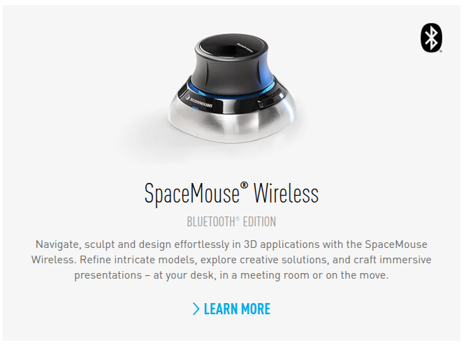
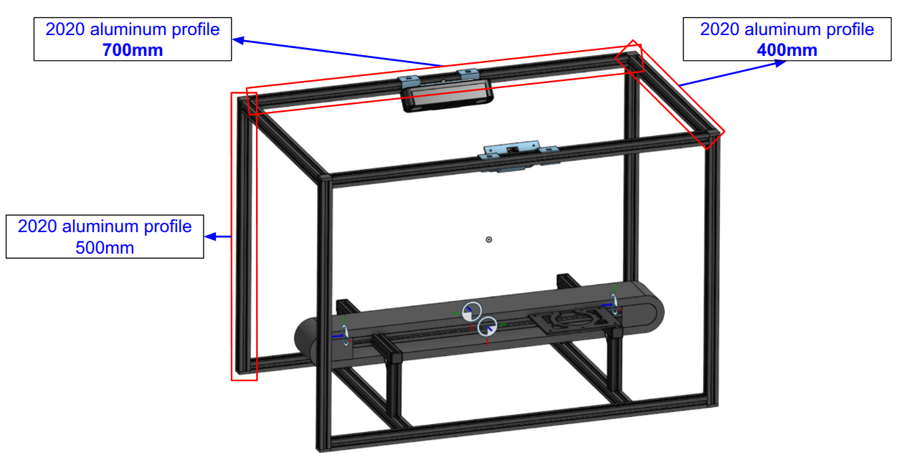

# Isaac Lab SES-V2-LSS Projects

## Overview

A project to train an arm-type robot to pick up and place objects well on a Conveyor belt using deep reinforcement learning.


## Installation

- Install Isaac Lab 5.0 version by following the [installation guide](https://isaac-sim.github.io/IsaacLab/main/source/setup/installation/index.html).
  We recommend using the conda or uv installation as it simplifies calling Python scripts from the terminal.

- Clone or copy this project/repository separately from the Isaac Lab installation (i.e., outside the `IsaacLab` directory):
  
  ```bash
  git clone https://github.com/kimbring2/isaac_lab_ses_v2_lss.git
  ```

- Teleoperation through [SpaceMouse Compact](https://3dconnexion.com/us/product/spacemouse-wireless/) and Keyboard Key.
  
  
  
  ```bash
  python scripts/teleop_se3_agent.py --task SES-V2-LSS-v0 --num_envs 1 --teleop_device composite --enable_cameras
  ```
  
  The keyboard T key is needed to toggle the translation through the x, y, and z axes. The R key is for rotation.

- Using a Python interpreter that has Isaac Lab installed, install the library in editable mode using:
  
  ```bash
  python -m pip install -e source/ses_v2_lss
  ```

- Verify that the extension is correctly installed by:
  
  - Listing the available tasks:
    
    ```bash
    python scripts/list_envs.py
    ```
  
  - Running a training:
    
    ```bash
    python scripts/skrl/train.py --task SES-V2-LSS-v0
    ```
  
  - Running a test
    
    ```bash
    python scripts/skrl/play.py --task SES-V2-LSS-v0 --num_envs 1
    ```

## Sim2Real

- To test this project with a real robot, you must buy a robot from [Lynxmotion SES-V2 Robotic Arm (5 DoF) w/ Smart Servos Kit](https://www.robotshop.com/products/lynxmotion-lss-5-dof-robotic-arm-kit?pr_prod_strat=e5_desc&pr_rec_id=3759c0319&pr_rec_pid=7487342149793&pr_ref_pid=7487349358753&pr_seq=uniform).

- [3D CAD Model](https://cad.onshape.com/documents/3c2163ae82e70e0ae247b87c/w/f8a0bd1dd5d6a5aa85850674/e/f551351d66d5d5d23cd354af?renderMode=0&uiState=69f6471ceffc1f077ddb9665)
  
   

- After that, you must assign IDs from Base to 1 through 6 to the SES-V2 servo motors and change the communication baud rate to 921600(The gripper motor ID must be 5. The wrist motor is 6). Please refer to the [# 02 - SES-V2](https://wiki.lynxmotion.com/info/wiki/lynxmotion/view/ses-v2/) link for detailed information about motor settings.

- After finishing the above settings, you can control the real robot through the command below. 
  
  ```bash
  python scripts/teleop_se3_agent_real.py --task SES-V2-LSS-v0 --num_envs 1 --teleop_device composite --enable_cameras
  ```

- Since the offset may vary depending on the motor assembly method, please check whether the motors on the simulator and the actual robot have the same angle.
